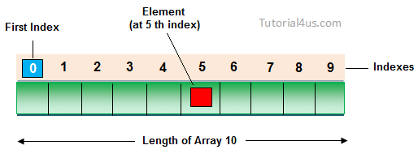

# STL

## Kontenery sekwencyjne

* Tablica: `<array>`
* Wektor: `<vector>`
* Lista dwukierunkowa: `<decque>`
* Lista: `<list>`
* Lista w przód: `<forward_list>`

___

<div style="text-align: center"></div>

___

## Podstawowe metody kontenerów sekwencyjnych

* <!-- .element: class="fragment fade-in" -->begin(), end(), rbegin(), rend()
* <!-- .element: class="fragment fade-in" -->cbegin(), cend(), crbegin(), crend()
* <!-- .element: class="fragment fade-in" -->size(), max_size(), empty()

___

## Podstawowe metody kontenerów sekwencyjnych (cd.)

* <!-- .element: class="fragment fade-in" -->resize()
* <!-- .element: class="fragment fade-in" -->front(), back()
* <!-- .element: class="fragment fade-in" -->assign(), emplace(), insert(), erase()
* <!-- .element: class="fragment fade-in" -->swap(), clear()

___

## Tablica: `<array>` - właściwości

* <!-- .element: class="fragment fade-in" -->ekwiwalent (z STL) Type a[]
* <!-- .element: class="fragment fade-in" -->ciągłość przechowywania na stosie ( data() ) 
* <!-- .element: class="fragment fade-in" -->łatwy dostęp do każdej wartości - O(1) 
* <!-- .element: class="fragment fade-in" -->kontener o stałym rozmiarze
 
___

## Tablica: `<array>` - właściwości (cd.)

* <!-- .element: class="fragment fade-in" -->może być używana jak std::tuple 
* <!-- .element: class="fragment fade-in" -->pamięć zajmują dane, brak dodatkowych komórek pamięci do obsługi tablicy
* <!-- .element: class="fragment fade-in" -->"cache-friendly"

___

## Tablica: `<array>`

<div style="text-align: center"></div>

___

## Przykład tablicy

```cpp
std::array<int, 5> a = { 1, 2, 4, 5, 6}; // eq. int a[5] = { 1, 2, 4, 5, 6};
a[0] = 5;			// a == { 5, 2, 4, 5, 6}
a.at(1) = 7;			// a == { 5, 7, 4, 5, 6}
a[4] = a.front();		// a == { 5, 2, 4, 5, 5}
a.fill(5);			// a == { 5, 5, 5, 5, 5}

std::cout << a.size() 		// 5
std::cout << a.max_size() 	// 5

std::array<int, 5> b = { 5, 6, 7, 8, 9};
b.swap(a); // a == { 5, 6, 7, 8, 9} , b == { 5, 5, 5, 5, 5}
```

___

## Zadanie 1

1. Stwórz std::array o rozmiarze: 10.
2. Uzupełnij ją wartością 5.
3. Do 4-ego elementu przypisz wartość 3.
4. Stwórz inną tablicę o tym samym rozmiarze.
5. Podmień tablice.
6. Wypisz obie tablice w osobnych liniach.

___

## Wektor: `<vector>` - właściwości

* <!-- .element: class="fragment fade-in" -->dynamicznie alokowany na stercie
* <!-- .element: class="fragment fade-in" -->ciągłość przechowywania ( data() ) 
* <!-- .element: class="fragment fade-in" -->łatwy dostęp do każdej wartości - O(1) 
* <!-- .element: class="fragment fade-in" -->można zmieniać jego rozmiar

___

## Wektor: `<vector>` - właściwości (cd.)

* <!-- .element: class="fragment fade-in" -->wstawianie elementów na końcu wektora zajmuje stały czas - O(1)
* <!-- .element: class="fragment fade-in" -->"cache-friendly"

___

## Dodatkowe metody:

* <!-- .element: class="fragment fade-in" -->resize(), shrink_to_fit()
* <!-- .element: class="fragment fade-in" -->capacity()
* <!-- .element: class="fragment fade-in" -->reserve()
* <!-- .element: class="fragment fade-in" -->push_back(), pop_back(), emplace_back()
* <!-- .element: class="fragment fade-in" -->data()

___

## Zadanie 2

1. Stwórz wektor o wartościach { 1, 2, 4, 5, 6 }.
2. Usuń pierwszą wartość.
3. Dodaj wartość 5 na końcu wektora.
4. Dodaj wartość 12 na początku wektora (emplace).
5. Wypisz rozmiar wektora i maksymalny możliwy rozmiar.
6. Wypisz wektor.
7. Wyczyść wektor.
8. Wypisz rozmiar wektora.

___

## Zadanie 3

1. Stwórz pusty wektor.
2. Wypisz rozmiar i pojemność wektora.
3. Zmień rozmiar wektora na 10 i wypełnij go wartością 5.
4. Wypisz rozmiar i pojemność wektora.
5. Zarezerwuj pamięć na 20 elementów.
6. Wypisz rozmiar i pojemność wektora.
7. Zredukuj pojemność wektora (metodą shrink_to_fit()).
8. Wypisz rozmiar i pojemność wektora.

___

## Wektor bool: `std::vector<bool>` - właściwości

* <!-- .element: class="fragment fade-in" -->optymalizacja zajmowanego miejsca (jak dynamiczny bitset)
* <!-- .element: class="fragment fade-in" -->elementy nie są tworzone przy użyciu alokatora
* <!-- .element: class="fragment fade-in" -->do uzyskiwania dostępu używana jest klasa typu proxy
* <!-- .element: class="fragment fade-in" -->wskaźniki i iteratory nie są intuicyjne
  
___

## Lista dwukierunkowa: `<decque>` - właściwości

* <!-- .element: class="fragment fade-in" -->podobna do wektora
* <!-- .element: class="fragment fade-in" -->wstawianie elementów na początku i końcu wektora zajmuje stały czas - O(1)
* <!-- .element: class="fragment fade-in" -->łatwy dostęp do każdej wartości - O(1) 
* <!-- .element: class="fragment fade-in" -->brak ciągłości przechowywanie w pamięci
  
___

## Dodatkowe metody:

* <!-- .element: class="fragment fade-in" -->shrink_to_fit()
* <!-- .element: class="fragment fade-in" -->push_back(), pop_back(), emplace_back()
* <!-- .element: class="fragment fade-in" -->push_front(), pop_front(), emplace_front()

___

## Lista: `<list>` - właściwości

* <!-- .element: class="fragment fade-in" -->dwukierunkowy dostęp - O(N)
* <!-- .element: class="fragment fade-in" -->każdy element posiada dwa wskaźniki
* <!-- .element: class="fragment fade-in" -->dodawanie i kasowanie elementów zajmuje stały czas - O(1)

___

## Lista: `<list>` - właściwości (cd.)

* <!-- .element: class="fragment fade-in" -->nie można posługiwać się iteratorami
* <!-- .element: class="fragment fade-in" -->"cache inefficient"

___

## Dodatkowe metody:

* <!-- .element: class="fragment fade-in" -->push_back(), pop_back(), emplace_back()
* <!-- .element: class="fragment fade-in" -->push_front(), pop_front(), emplace_front()
* <!-- .element: class="fragment fade-in" -->splice(), unique(), merge(), sort(), reverse()
* <!-- .element: class="fragment fade-in" -->remove(), remove_if()

___

## Lista w przód: `<forward_list>` - właściwości

* <!-- .element: class="fragment fade-in" -->jednokierunkowy dostęp - O(N)
* <!-- .element: class="fragment fade-in" -->każdy element posiada jeden wskaźnik
* <!-- .element: class="fragment fade-in" -->szybkie wstawianie i usuwanie elementów - O(1)
  
___

## Lista w przód: `<forward_list>` - właściwości (cd.)

* <!-- .element: class="fragment fade-in" -->"cache inefficient"
* <!-- .element: class="fragment fade-in" -->mimo wszystko bardziej skuteczna niż std::list (w przetwarzaniu i alokacji pamięci)

___

## Dodatkowe metody:

* <!-- .element: class="fragment fade-in" -->insert_after(), emplace_after(), erase_after()
* <!-- .element: class="fragment fade-in" -->push_front(), pop_front(), emplace_front()
* <!-- .element: class="fragment fade-in" -->splice(), unique(), merge(), sort(), reverse()
* <!-- .element: class="fragment fade-in" -->remove(), remove_if()

___

## Metody, których już nie użyjemy:

* <!-- .element: class="fragment fade-in" -->rbegin(), rend()
* <!-- .element: class="fragment fade-in" -->crbegin(), crend(), size(), back()
  
___

## Zadanie 4

1. Stwórz pustą listę.
2. Uzupełnij ją liczbami z przedziału od 1 do 1 000 000.
3. Zmierz czas wykonania (w terminalu: time ./a.out).
4. Wypisz wartość elementu z indeksem 500 000.
5. Zmierz czas wykonania.
6. Zamień listę na wektor.
7. Zmierz czas wykonania.