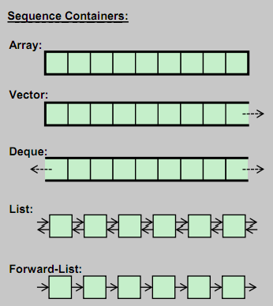

# STL

## Kontenery sekwencyjne

* Tablica: `<array>`
* Wektor: `<vector>`
* Lista dwukierunkowa: `<decque>`
* Lista: `<list>`
* Lista w prz¢d: `<forward_list>`

___



___

## Podstawowe operatory kontener¢w sekwencyjnych

* <!-- .element: class="fragment fade-in" -->begin(), end(), rbegin(), rend()
* <!-- .element: class="fragment fade-in" -->cbegin(), cend(), crbegin(), crend()
* <!-- .element: class="fragment fade-in" -->size(), max_size(), empty()

___

## Podstawowe operatory kontener¢w sekwencyjnych (cd.)

* <!-- .element: class="fragment fade-in" -->resize()
* <!-- .element: class="fragment fade-in" -->front(), back()
* <!-- .element: class="fragment fade-in" -->assign(), emplace(), insert(), erase()
* <!-- .element: class="fragment fade-in" -->swap(), clear()

___

## Tablica: `<array>` - wàaòciwoòci

* <!-- .element: class="fragment fade-in" -->ekwiwalent (z STL) Type a[]
* <!-- .element: class="fragment fade-in" -->ci•gàe przechowywanie na stosie ( data() ) 
* <!-- .element: class="fragment fade-in" -->dost©p do kaædej wartoòci - O(1) 
* <!-- .element: class="fragment fade-in" -->kontener o staàym rozmiarze
 
___

## Tablica: `<array>` - wàaòciwoòci (cd.)

* <!-- .element: class="fragment fade-in" -->moæe byÜ uæywana jak std::tuple 
* <!-- .element: class="fragment fade-in" -->pami©Ü zajmuj• dane, brak dodatkowych kom¢rek pami©ci do obsàugi tablicy
* <!-- .element: class="fragment fade-in" -->cache-friendly

___

## Tablica: `<array>`


___

## Przykàad tablicy

```cpp
std::array<int, 5> a = { 1, 2, 4, 5, 6}; // eq. int a[5] = { 1, 2, 4, 5, 6};
a[0] = 5;			// a == { 5, 2, 4, 5, 6}
a.at(1) = 7;			// a == { 5, 7, 4, 5, 6}
a[4] = a.front();		// a == { 5, 2, 4, 5, 5}
a.fill(5);			// a == { 5, 5, 5, 5, 5}

std::cout << a.size() 		// 5
std::cout << a.max_size() 	// 5

std::array<int, 5> b = { 5, 6, 7, 8, 9};
b.swap(a); // a == { 5, 6, 7, 8, 9} , b == { 5, 5, 5, 5, 5}
```

___

## èwiczenie

1. Stw¢rz std::array o rozmiarze: 10.
2. Uzupeànij j• wartoòci• 5.
3. Do 4-ego elementu przypisz wartoòÜ 3.
4. Stw¢rz inn• tablic© o tym samym rozmiarze.
5. Podmie‰ tablice.
6. Wypisz obie talbice w osobnych liniach.

___

## Wektor `<vector>`
